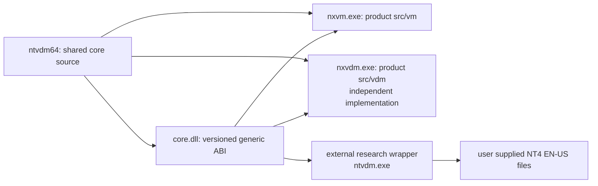

# M11 NT4 EN-US NTDOS Wrapper Compatibility Contract

Status: architecture and source-reading research only. This document makes no
code change to `ntvdm64`, provides no Microsoft file, and is not a build or
distribution specification for Microsoft components.

## 1. Fixed Research Target

The target is the Windows NT 4.0 English (United States) NTDOS environment
represented by the public OpenNT source tree. Later Microsoft NTVDM releases
and NTVDMx64 are not normative sources for this contract. NTVDMx64 remains
useful only as an independent demonstration that a modern executor can
intercept guest transitions; it must not decide NT4 behavior.

The future target binary set is BYOB and version-locked. The wrapper must
reject an incomplete or inconsistent set before guest execution. At minimum,
the set requires an explicit manifest entry for each supplied component that
the selected profile uses, such as `NTIO.SYS`, `NTDOS.SYS`, `COMMAND.COM`,
`HIMEM.SYS`, `DOSX.EXE`, `CONFIG.NT`, and `AUTOEXEC.NT`. File names alone are
not proof of compatibility. Exact validation rules require a later owner
decision on which local metadata may be recorded and retained.

## 2. Product And Repository Boundary

The intended architecture now has three products, not one mixed runtime.

| Product | Ownership and role | Must not contain |
| --- | --- | --- |
| `core.dll` | Releasable generic machine and host-capability ABI | Microsoft selectors, structures, binary assumptions, or Windows private ABI |
| `nxvm.exe` | Releasable bootable NXVM product, implemented in `src/vm` | External wrapper policy or protected guest files |
| `nxvdm.exe` | Releasable independently implemented VDM product, implemented in `src/vdm` | Microsoft-specific compatibility ABI or guest assets |
| external `ntvdm.exe` | Local research wrapper for the fixed NT4 EN-US profile | A claim of independent implementation or redistributable Microsoft runtime |

The external wrapper is intentionally out of the `ntvdm64` repository. This
research directory records its contract but does not create, build, or track
that project.

The decisive promotion test is: if an NT4 EN-US requirement cannot be named
without a Microsoft selector, byte layout, service identifier, file name, or
guest convention, it is wrapper code, not a new `core.dll` export. If it can
be specified as a reusable machine behavior or policy-free host capability and
can serve both NXVM and another VDM, it is a core candidate.

## 3. Direct OpenNT Facts

### 3.1 NTIO and NTDOS are separately built guest layers

`base/mvdm/dos/v86/doskrnl/bios/makefile` builds `ntio.sys`. Its object list
includes BIOS initialization, INT 13 support, system initialization,
configuration parsing, keyboard, mouse, EMS, and other BIOS-side pieces. The
same file says the USA build selects the `usa-ms.msg` message input.

`base/mvdm/dos/v86/doskrnl/dos/makefile` separately builds `ntdos.sys`. Its
object list includes the DOS kernel's file, directory, device, process, lock,
FCB, disk, time, initialization, and server-call modules. This proves that
NTIO and NTDOS are distinct guest artifacts with a linked runtime contract;
they are not interchangeable implementations of a single ROM.

### 3.2 SVC is the NT4 DOS-to-host service protocol

`base/mvdm/inc/DOSSVC.INC` defines `SVC(func)` as `BOP BOP_DOS` followed by a
one-byte function id. `BOP_DOS` is `0x50` in `base/mvdm/inc/bop.h`. Therefore
an SVC call is the BOP guest transition plus a subfunction byte, not an INT 21
call and not the DOS-internal `$ServerCall` table.

The source assigns function ids `0x00` through `0x48`. The named families are:

| Service family | Observed examples | Required wrapper category |
| --- | --- | --- |
| file and directory | open, create, read, write, seek, rename, delete, find | DOS namespace and file capability |
| drive and media | boot drive, drive count, free space, DPB, reset, absolute I/O | drive topology and block/media capability |
| file compatibility | FCB operations, file info, commit, lock, IOCTL | DOS file semantics adapter |
| time and environment | query/set date and time, computer name, code page | clock, locale and environment capability |
| guest bookkeeping | DTA location, V86 kernel address, hard error info, PDB terminate | checked guest memory and lifecycle support |
| runtime control | exit VDM, input/output strings, debugger and symbols | session, terminal and optional diagnostics |
| optional integration | WOW files, pipe EOF, app symbols | profile-gated services, unavailable by default |

`base/mvdm/dos/dem/demdisp.c` confirms this is an ordered host dispatch table:
it bounds-checks the id, stores the current id, clears the pending hard-error
flag when applicable, invokes the handler and leaves register/flag effects in
the live guest context. Several historical entries are explicitly represented
by a not-yet-implemented handler. Thus the wrapper may support a staged
profile, but it must define each unsupported service's guest-visible result;
silently omitting the transition is not compatible behavior.

### 3.3 The historical host application is not a reusable host ABI

`base/mvdm/softpc.new/obj.vdm/ntvdm.c` initializes timers, NLS, exception
handling, a host main routine, and a registry-backed CPU-environment override
mechanism. This is evidence of historical product composition, not a contract
for `core.dll`. The external wrapper must replace it with explicit local
configuration and capability binding. It must not need Windows registry state,
private console registration, process injection, or CSRSS integration.

## 4. Required External Wrapper Layers

The local research wrapper should be designed as six explicit layers. These
are an implementation plan, not current `ntvdm64` modules.

1. **BYOB profile validator.** Finds files in a user-approved directory,
   validates the selected NT4 EN-US manifest, and gives non-content-bearing
   diagnostics. It never copies files into `ntvdm64` or a release package.
2. **Guest image and bootstrap loader.** Places the selected NTIO/NTDOS
   artifacts, prepares guest low memory and starts the exact NT4 entry path.
   Its initial state is version-specific and belongs here even if the core
   exposes generic memory mapping and prepared-entry calls.
3. **NT4 transition adapter.** Registers BOP handling, recognizes BOP `0x50`,
   decodes its following SVC byte, and implements the source-defined SVC
   contract. XMS, DPMI, command and redirector selectors are separate,
   independently enabled adapters.
4. **DOS namespace service.** Translates DOS paths, drive letters, current
   directories, device names, 8.3 behavior, sharing, locking and errors into
   explicitly granted host filesystem capabilities. This is not `core/platform`
   policy.
5. **Machine-service adapter.** Binds timer, keyboard, display, block media,
   PIC/IRQ, A20, HMA and firmware/prepared-state facilities to the selected
   profile. It chooses which devices exist and whether BIOS or direct prepared
   entry is used.
6. **Session and containment policy.** Owns console, process lifetime, file
   access roots, diagnostics, user consent and default-deny behavior.

## 5. `core.dll` ABI Required By The Wrapper

This is a proposed generic ABI surface. It is deliberately stated in behavior,
not C or C++ declarations, until the current core implementation is assessed.

| ABI group | Core must provide | Core must not know |
| --- | --- | --- |
| identity | ABI version, feature/capability query, stable error domain | NT4 profile name or file set |
| lifetime | create/destroy machine, reset, pause/resume, deterministic stepping | NTIO/NTDOS loader stages |
| CPU state | read/write complete architecturally relevant CPU state at defined boundaries | BOP selector meanings or SVC register conventions |
| guest memory | checked copy/read/write, mapping query, fault-safe pointer translation | DOS buffers, DPL, DPB, PSP, BDA layouts |
| execution events | protocol-neutral transition registration, ordering, validation and resume/fault/stop/switch-mode outcomes | the `C4 C4` opcode or Microsoft's table as a named public API |
| machine wiring | ports, IRQ, DMA, timer, A20, RAM, ROM/image mapping, firmware or prepared entry | default NT4 device choices |
| host injection | policy-free file, stream, clock, input, display and media capability interfaces | drive letters, DOS path policy, console defaults |
| observation | structured diagnostics and tracing with caller-controlled redaction | guest binary content or protected paths |

The ABI must not expose raw core C++ classes, private headers, process-global
state, or caller-owned pointers into unvalidated guest memory. `nxvm.exe`,
`nxvdm.exe`, and the external wrapper should all be able to consume the same
published ABI.

## 6. Resulting Core And VM Boundary Corrections

The existing move-from-VM proposal needs these refinements.

### Promote into `core/machine` when validated

* Generic transition/event dispatch and checked guest-state access.
* A20 line behavior, observable state and HMA-relevant address semantics.
* Real-mode, protected-mode and V86 transition correctness, including
  interrupt/exception return behavior needed by generic x86 execution.
* Generic IVT/interrupt wiring, PIC/PIT/DMA integration and deterministic
  timing primitives.
* Firmware-image mapping, reset-vector entry and a prepared-entry mechanism.
* Policy-free device topology and controller mechanics after they are detached
  from VM image files and UI decisions.

### Keep in `src/vm`

* NXVM's default PC/AT profile, generated firmware program, boot ordering,
  image mount commands, host paths, renderer/window behavior and console
  policy.
* VM-specific controller backends until their mechanics have a separate media
  abstraction and focused cross-product tests.

### Keep out of `ntvdm64`

* The NT4 binary manifest and all binary validation rules.
* BOP selector and SVC function semantics, DOS communication blocks and
  guest-private structures.
* DOS path/drive mapping, NT4 startup images, NTDOS error policy, redirector,
  WOW, and diagnostics that name or inspect protected components.

## 7. Compatibility Work Packages

The unresolved work is now concrete enough to sequence without guessing.

| Order | Research/output | Acceptance evidence |
| --- | --- | --- |
| 1 | NT4 EN-US BYOB manifest policy | selected component roles, matching rules and no-redistribution review |
| 2 | NTIO bootstrap state card | source path/symbol, required memory range, IVT/BDA/ROM ownership, CPU state, and unknown fields explicitly marked |
| 3 | BOP/SVC call ledger | one row per selector/service: input state, guest memory ranges, effects, errors, sync/async behavior, profile tier |
| 4 | device-minimum matrix | boot/runtime/optional classification for timer, PIC, keyboard, video, disk, CMOS, A20, XMS, DPMI, EMS and redirector |
| 5 | core.dll gap matrix | each generic requirement mapped to current core, VM-only code, missing API, owner and test shape |
| 6 | passive trace design | redacted event/state trace that records no guest bytes or files and tests only user-supplied local media |

No wrapper implementation should begin before items 1 through 3 identify a
single boot path and its required services. No `core.dll` API should be added
only because one SVC row asks for it; the row must first be reduced to a
generic machine or capability requirement.

## 8. Remaining Unknowns

OpenNT source has now answered the broad protocol topology, but these facts
still require deeper source mapping or a version-locked passive trace:

* exact NT4 EN-US artifact provenance and configuration-to-binary matching;
* the byte-level NTIO entry state, loader placement, communication blocks and
  whether prepared entry can replace all BIOS-side work;
* parameters, flags, buffers, reentrancy and asynchronous behavior of every
  BOP/SVC operation;
* the smallest device set that completes boot and supports the intended DOS
  workload;
* the exact current `core.dll` gaps for protected mode, V86, A20, interrupt
  timing and guest-memory validation;
* filesystem semantics needed for an acceptable DOS namespace without
  inheriting historical Windows-private integration.

## 9. Source Evidence Index

The following public OpenNT paths were directly inspected for this contract:

* `base/mvdm/dos/v86/doskrnl/bios/makefile`
* `base/mvdm/dos/v86/doskrnl/dos/makefile`
* `base/mvdm/inc/bop.h`
* `base/mvdm/inc/DOSSVC.INC`
* `base/mvdm/dos/dem/demdisp.c`
* `base/mvdm/softpc.new/host/src/nt_bop.c`
* `base/mvdm/v86/monitor/i386/monitor.c`
* `base/mvdm/v86/monitor/i386/monitorp.h`
* `base/mvdm/dos/v86/doskrnl/bios/{biosbop.inc,msinit.asm,sysinit1.asm}`
* `base/mvdm/dos/v86/doskrnl/dos/{msinit.asm,srvcall.asm}`
* `base/mvdm/dos/v86/dev/himem/himem.asm`
* `base/mvdm/softpc.new/obj.vdm/ntvdm.c`
