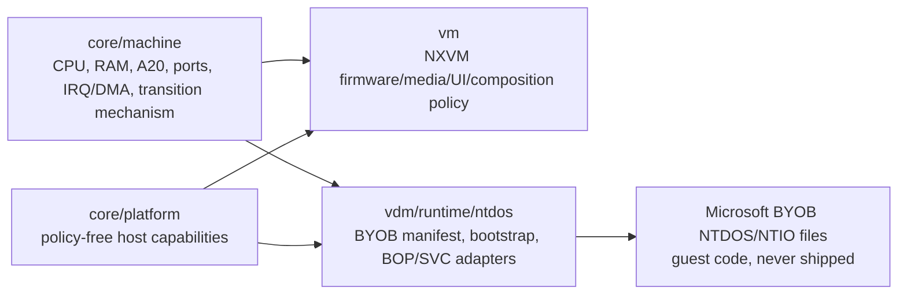

# M11 OpenNT NTDOS Source-Evidence Addendum

Status: read-only architecture research.  This document records source facts
from the public OpenNT tree; it introduces no OpenNT source, Microsoft guest
binary, build input, or runtime dependency into `ntvdm64`.

## Scope And Confidence

This addendum upgrades the M11 conclusions from indirect historical evidence
to directly read source evidence for the classic NT MVDM implementation.
OpenNT is a historical source reference, not a code donor and not a licensing
decision.  The conclusions below concern required *shapes of interaction*, not
permission to redistribute, compile, or reuse any referenced component.

Inspected revision: public `Paolo-Maffei/OpenNT`, `master`, accessed in a
temporary non-workspace clone on 2026-08-05.  Only selected source blobs were
read.  No source blob was copied to this research directory.

## Executive Conclusion

The source confirms a three-part NTDOS environment:

1. `NTIO.SYS`/BIOS-side code establishes DOS-visible machine state, interrupt
   vectors, configuration/device initialization, XMS/HMA services and the
   handoff into DOS initialization.
2. `NTDOS.SYS` contains the DOS kernel and calls a DOS-emulation service
   interface for host-derived state such as drive enumeration, hard-error
   information, system-symbol actions and DOS data-area publication.
3. The monitor/SoftPC host owns a 256-slot BOP dispatch namespace.  A BOP is a
   machine trap (`C4 C4 selector`), and selector handlers bridge guest state to
   host subsystems including DOS emulation, XMS, DPMI, command dispatch,
   redirector, keyboard, video, idle, debugging and mode switching.

So NTDOS is neither an ordinary boot-from-ROM PC guest nor merely an INT 21h
library.  It is a guest runtime that expects both PC-compatible state and a
version-specific guest-to-host protocol.  Those are distinct responsibilities.

## Direct Findings

### A. BOP is the explicit guest-to-host trap ABI

`base/mvdm/dos/v86/doskrnl/bios/biosbop.inc` defines the assembler macro as
the three bytes `C4 C4 <callid>`.  `base/mvdm/inc/bop.h` independently defines
the C macro in the same form and declares `BOP_SIZE` as three bytes.  This
matches the direct NTVDMx64 monitor finding, where the executor consumes three
bytes before dispatching the selector.

The OpenNT selector assignments include:

| Selector | Role established by source | Architectural owner in this project |
| --- | --- | --- |
| `0x50` | DOS emulation (`BOP_DOS`) | NTDOS adapter, never generic core |
| `0x51` | WOW (`BOP_WOW`) | out of current scope |
| `0x52` | XMS (`BOP_XMS`) | NTDOS adapter over generic A20/HMA/memory facilities |
| `0x53` | DPMI (`BOP_DPMI`) | NTDOS adapter over CPU-mode/descriptor facilities |
| `0x54` | command dispatch (`BOP_CMD`) | optional NTDOS runtime service |
| `0x56` | debugger | diagnostic-only adapter concern |
| `0x57` | redirector (`BOP_REDIR`) | optional, capability-bound adapter service |
| `0x5A` | idle notification | generic scheduling hint may be core; selector is adapter-only |
| `0x5C` / `0x5D` | keyboard / video | adapter mappings to generic devices |
| `0xFD` / `0xFE` | switch to real mode / cease simulated execution | generic transition outcomes; selector is adapter-only |

This is the clearest boundary result in the research: **core may expose the
mechanism to intercept a guest transition; it must not expose the Microsoft
selector namespace or Microsoft parameter layouts.**

### B. The monitor owns dispatch; NTDOS owns selector meaning

`base/mvdm/v86/monitor/i386/monitor.c` declares an external `BIOS[]` dispatch
table and implements `EventVdmBop`.  It validates the selector against
`MAX_BOP`, then invokes `BIOS[VdmTib.EventInfo.BopNumber]()`.  The adjacent
`monitorp.h` defines `MAX_BOP` as 256 and declares `MsBop0` through `MsBopF`,
plus reset, timer, keyboard, diskette, video, memory, disk I/O, serial,
printer, bootstrap, redirector, EMS, RTC, mouse, protected-mode and control
handler families.

This establishes two non-negotiable implementation properties for a future
adapter:

* dispatch operates on a live guest CPU/memory context and returns to the
  executor; it is not an RPC from DOS source to C;
* registry ordering, selector uniqueness, guest-memory validation, register
  effects, resume/fault/stop outcomes, and reentrancy are runtime ABI issues.

For `ntvdm64`, the durable core primitive should therefore resemble a generic
`guest_transition` registration and execution result, usable by invalid-opcode
traps, firmware hooks, I/O interception or an explicit adapter instruction.
The NTDOS profile alone registers the `0x50`-family conventions.

### C. `nt_bop.c` proves the selector families are functional bridges

`base/mvdm/softpc.new/host/src/nt_bop.c` provides the host-side behaviour:

* `MS_bop_0` reads one additional guest byte through checked VDM pointer
  translation, calls `DemDispatch(command)`, advances IP, and applies an idle
  policy except for date/time commands.
* `MS_bop_2` invokes `XMSDispatch` with a function byte read from the guest
  instruction stream, then advances IP.
* `MS_bop_3` invokes `DpmiDispatch`.
* `MS_bop_4` obtains a command byte from guest memory and invokes
  `CmdDispatch`.
* `MS_bop_7` lazily loads `VDMREDIR`, resolves its entry points, dispatches
  redirector calls and returns an ordinary DOS error when unavailable.

The important design lesson is not to reproduce dynamic DLL loading.  It is
that the historic ABI is a set of independent service families, each with a
separate guest calling convention and optionality.  A future BYOB profile
needs a manifest and registration table that can say, for example, "DOS and
XMS enabled, redirector absent", rather than one all-or-nothing `ntdos_mode`.

### D. `NTDOS.SYS` calls a host-derived DOS-emulation service surface

`base/mvdm/dos/v86/doskrnl/dos/msinit.asm` includes `doswow.inc` and contains
calls such as `SVC_DEMGETDRIVES`, `SVC_DEMSETDTALOCATION`,
`SVC_DEMSETHARDERRORINFO`, `SVC_DEMGETDPBLIST`, and
`SVC_DEMSYSTEMSYMBOLOP`.  The initialization code also reads the DOS/BIOS
communication block, establishes IVT entries, initializes DOS process/data
areas, and probes XMS via INT `2Fh` before using HMA-related paths.

This proves that a usable NTDOS runtime needs more than a disk image and a
CPU reset vector.  It requires a bootstrap contract that can supply at least:

* a version-locked DOS/BIOS communication block or equivalent prepared state;
* drive and DPB topology, including an explicit no-drive/drive-count result;
* hard-error and DTA/data-area handoff locations in guest memory;
* interrupt vector ownership and real-mode entry state;
* optional XMS/HMA availability and INT `2Fh` discovery;
* a defined policy for unsupported optional services.

The exact byte layout and initial register values remain version-specific and
must come from a selected BYOB runtime trace.  They are not safe to infer from
one historical source snapshot.

### E. `NTIO.SYS` is a machine-facing initialization environment

`base/mvdm/dos/v86/doskrnl/bios/msinit.asm` shows that BIOS-side initialization
installs/updates interrupt vectors and transfers to `sysinit`.  The associated
`sysinit1.asm` defines NTVDM-specific configuration and device handling,
references an internal mouse device, keyboard/mouse/EMS helper segments,
`DemInfoFlag`, XMS/HMA state, ROM vectors, and `seg_reinit` relocation state.
It also carries configuration parsing and device-driver load phases.

`base/mvdm/dos/v86/dev/himem/himem.asm` confirms that HIMEM is not merely a
host memory allocation request.  It provides an XMS device header, INT `2Fh`
install/function-address behavior, XMS function dispatch, reference-counted
A20 control, HMA allocation, and an INT `15h` hook.  Its A20 routines call a
machine-specific `A20Handler` and preserve/restore A20 around relevant paths.

Therefore, the project should treat the following as potential shared
machine-foundation capabilities, independent of one DOS product:

* 20-bit wrap/A20 gate semantics and observable A20 state;
* IVT read/write and ordered interrupt-hook facilities;
* real-mode plus protected-mode/V86 execution transitions;
* HMA and conventional/extended-memory topology;
* programmable timer/interrupt delivery; and
* ROM or synthesized firmware mapping plus a prepared-entry alternative.

It does **not** follow that core should include the historical HIMEM driver,
NTIO configuration parser, internal mouse driver, or Microsoft device names.
Those are guest/runtime assets and profile policy.

### F. `srvcall.asm` is not the host BOP ABI

`base/mvdm/dos/v86/doskrnl/dos/srvcall.asm` defines `$ServerCall`, a DOS-kernel
internal table dispatch over a DPL (DOS process list) context.  Its documented
AL functions include commit/close operations, DOS data-area access, spool
operations and extended-error setup.  It copies DPL register context to/from
the DOS user stack and then enters the kernel redispatch path.

This corrects an easy architectural mistake: the file name "server call" does
not mean "generic host API."  It is a DOS internal process/file-service
mechanism.  It should neither be placed in `core/platform` nor modeled as a
new project interface.  The meaningful host boundary is the monitor/BOP/SVC
surface, mediated by an NTDOS-specific adapter.

## Revised Layer Model

`vm` and an NTDOS runtime consume the same expanded core only where a
capability is generic and independently useful.  An NTDOS-only selector,
communication block, command code, device name, binary validation rule, or
Windows-private behavior stays in the NTDOS adapter.  No extra `mantle` layer
is needed: that name would obscure the same test, not solve it.

## Concrete Effects On The Existing Migration Proposal

The source evidence raises confidence in the following core candidates:

| Candidate | Evidence | Required boundary before promotion |
| --- | --- | --- |
| Generic guest transition registry/outcomes | BOP monitor dispatch and mode-switch selectors | no BOP names/numbers in public core API |
| A20/HMA observability | HIMEM XMS and INT 15/2F paths | defined behavior in CPU/memory contract, not a DOS driver |
| Firmware image mapping + prepared entry | NTIO initialization plus DOS/BIOS communication state | binary ROM, generated image and no-ROM prepared modes all supported |
| Interrupt/vector initialization support | NTIO/NTDOS install and hook paths | profile controls contents and ordering |
| Device/topology descriptors | drive queries, DPB and communication block | no host file paths or NXVM command policy |
| Clock/idle scheduling hook | `MS_bop_0` idle behavior and timer handlers | generic advisory hint; no selector in core |

It does not raise confidence enough to move complete FDC, ATA, video, mouse,
network redirector, printer, serial, EMS, or command interpreter semantics
without first splitting their reusable controller mechanics from product and
host policy.  The source proves those families existed, not the minimum
requirements of a particular supplied binary set.

## Research Limits And Next Evidence

This report deliberately does not claim a specific Microsoft binary will boot
on the current repository.  Missing proof still includes selected-version
entry registers, communication-block bytes, media layout, exact selector
parameters, asynchronous behavior, and the smallest viable BYOB file set.

The next safe research stage is passive, owner-provided BYOB tracing against a
single version-locked runtime.  It should record initial CPU/memory state and
generic transition events while keeping binary paths, contents and hashes out
of the repository unless the owner separately approves local evidence storage.

## Source Index

All paths are relative to the temporary public OpenNT checkout:

* `base/mvdm/inc/bop.h`
* `base/mvdm/v86/monitor/i386/monitor.c`
* `base/mvdm/v86/monitor/i386/monitorp.h`
* `base/mvdm/softpc.new/host/src/nt_bop.c`
* `base/mvdm/dos/v86/doskrnl/bios/biosbop.inc`
* `base/mvdm/dos/v86/doskrnl/bios/msinit.asm`
* `base/mvdm/dos/v86/doskrnl/bios/sysinit1.asm`
* `base/mvdm/dos/v86/doskrnl/dos/msinit.asm`
* `base/mvdm/dos/v86/doskrnl/dos/srvcall.asm`
* `base/mvdm/dos/v86/dev/himem/himem.asm`
